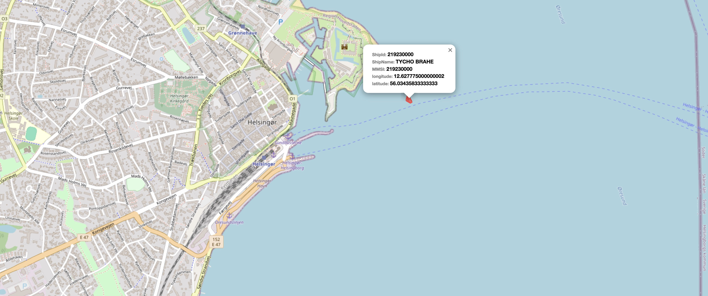
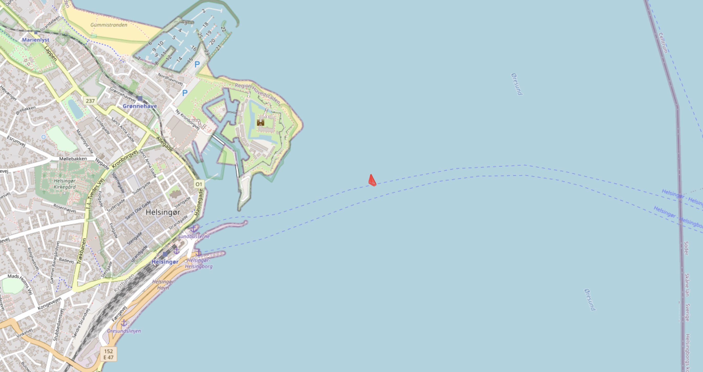

# `Trace-boat-on-map`

# Contents

    1. Description

    2. Demo
    
    3. Run

    4. Packages
    
    5. APIs

    6. Preview of the project

       

# Description

Display the location of a boat in real-time with additional information on OpenStreetMap.
Allow users to zoom in/out and pan across the map.

Real-Time Data Visualization:

Connect to API (https://aisstream.io/) that provides real-time data of boat the boat with MMSI 219230000.
Update the boat locations on the map in real-time.
Display basic information about the boat (e.g., name, shipid) when clicked.

# Demo

# Run

### Server:
In the project directory, you can run:
#### node index.js

### Client:
In the node directory, you can run:
#### npm start

Runs the app in the development mode.
Open http://localhost:3000 to view it in the browser.

# Packages

These packages are installed in this project:

- leaflet

- react-leaflet

- react-leaflet/core

- react-loader-spinner

- ws

- express

# APIs

In this project, https://aisstream.io/ APIs are used to get boat information.
OpenStreetMap APIs are used for the map.

# Preview of the project

